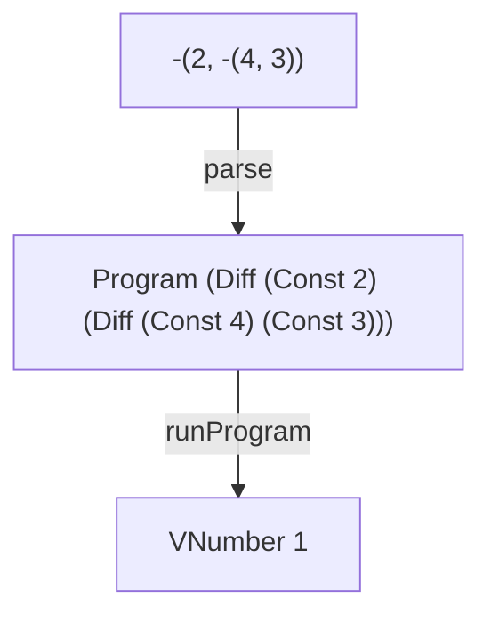

# DIFF

A tiny interpreter in Elm that adds recursive difference expressions.

DIFF builds on [CONST](https://github.com/tinyinterpreters/const), where we established the basic source text → AST → value structure. Allowing an expression to contain other expressions introduces recursion throughout the grammar, AST, parser, and interpreter.

Read [DIFF: Adding Recursive Expressions to a Tiny Interpreter in Elm](https://blog.tinyinterpreters.dev/posts/diff) for a guided explanation of how it works.



## Usage

You’ll need [Nix](https://zero-to-nix.com/start/install/) with flakes enabled.

Enter the development environment and start the Elm REPL:

```bash
nix develop
elm repl
```

Import the interpreter and run a program:

```elm
import DIFF.Interpreter as I

I.run "-(456, 123)"
-- Ok (VNumber 333)
```

## Language

DIFF supports non-negative integer constants:

```txt
123
```

and difference expressions:

```txt
-(456, 123)
```

A difference expression evaluates its two operands and subtracts the second number from the first.

Because each operand is itself an expression, difference expressions can be nested:

```txt
-(2, -(4, 3))
```

## Recursive expressions

The grammar describes both operands of a difference expression as expressions:

```ebnf
Diff ::= '-' '(' Expr ',' Expr ')'
```

That recursive structure appears in the AST:

```elm
Diff Expr Expr
```

and continues through the parser and interpreter. Each part follows the shape of the language it represents.

## Tiny Interpreters

DIFF is part of [Tiny Interpreters](https://blog.tinyinterpreters.dev), a blog about learning how programming languages work by building small interpreters in Elm.
