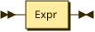
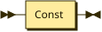
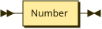
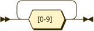

**Program:**



```
Program  ::= Expr
```

**Expr:**



```
Expr     ::= Const
```

referenced by:

* Program

**Const:**



```
Const    ::= Number
```

referenced by:

* Expr

**Number:**



```
Number   ::= [0-9]+
```

referenced by:

* Const

## 
 <sup>generated by [RR - Railroad Diagram Generator][RR]</sup>

[RR]: https://www.bottlecaps.de/rr/ui